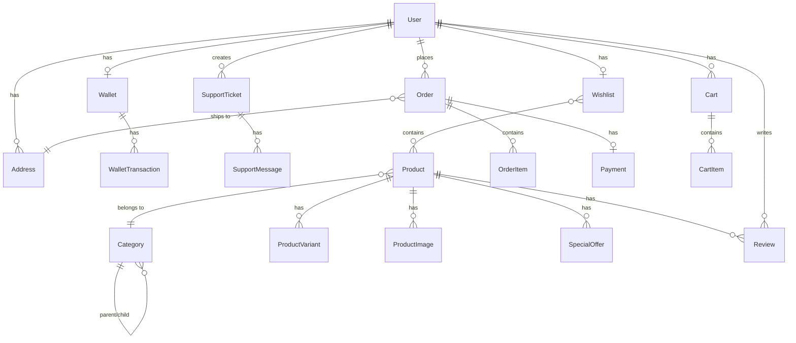

# Teecom (LUMOCART) — Full Project Analysis

## Overview

**Teecom** is a **full-stack e-commerce platform** (branded **LUMOCART** in the admin panel). It's a monorepo with three main components:

| Component | Tech Stack | Port | Purpose |
|---|---|---|---|
| `backend/` | Django 6.0 + DRF + PostgreSQL | `:8000` | REST API server |
| `frontend/` | Next.js 16.2 + React 19 + Tailwind v4 | `:3000` | Customer-facing storefront |
| `admin-dashboard/` | Next.js 16.2 + React 19 + Tailwind v4 | `:3001` (likely) | Admin management panel |

Infrastructure: **Docker Compose** with PostgreSQL 15, Redis 7, Celery worker.

---

## Backend Architecture (Django REST Framework)

### Django Apps & Data Models



### App Breakdown

| App | Models | Purpose |
|---|---|---|
| **accounts** | `User`, `Address`, `Wallet`, `WalletTransaction`, `SupportTicket`, `SupportMessage` | Custom user with roles (customer/admin/support/manager), addresses, wallet system, support tickets |
| **products** | `Product`, `ProductVariant`, `ProductImage`, `SpecialOffer`, `NewsletterSubscriber` | Product catalog with variants (size/color), images via Cloudinary, promotions |
| **categories** | `Category` | Hierarchical categories (self-referencing parent FK) |
| **carts** | `Cart`, `CartItem` | Shopping cart with price snapshots |
| **orders** | `Order`, `OrderItem`, `Coupon`, `Wishlist` | Order lifecycle (pending→paid→processing→shipped→delivered), coupons, wishlists |
| **payments** | `Payment` | Payment tracking (Stripe/PayPal/Wallet) |
| **shipping** | `ShippingMethod` | Configurable shipping methods |
| **reviews** | `Review` | Product reviews with ratings |
| **dashboard** | *(no models)* | Admin analytics API (revenue, orders, customers) |

### API Surface

| Endpoint Prefix | Key Routes |
|---|---|
| `/api/accounts/` | `register/`, `login/` (JWT), `me/`, `addresses/`, `wallet/`, `support/` |
| `/api/products/` | CRUD with search/filter, public read, admin write |
| `/api/categories/` | Category listing |
| `/api/carts/` | `current/`, item CRUD |
| `/api/orders/` | Order CRUD, `wishlist/add_product/`, `coupons/{code}/validate/` |
| `/api/payments/` | Payment processing |
| `/api/shipping/` | `methods/` |
| `/api/reviews/` | Public read, authenticated write |
| `/api/dashboard/` | `stats/` (admin-only analytics) |

### Auth & Security
- **JWT Authentication** via `djangorestframework-simplejwt`
- **Role-based permissions**: `IsOwner`, `IsOwnerOrAdmin`, `IsAdminUser`
- Custom `User` model with `email` as `USERNAME_FIELD`
- Rate limiting: 100/day anon, 1000/day authenticated, 5/min auth attempts
- Security headers (XSS filter, HSTS, SSL redirect in production)
- CORS configured via env vars

### Infrastructure
- **Database**: PostgreSQL 15 (via `dj-database-url`, SQLite fallback)
- **File Storage**: Cloudinary (media uploads)
- **Task Queue**: Celery + Redis 7
- **Email**: SMTP (Gmail configured)

---

## Frontend (Customer Storefront)

### Tech Stack
- **Next.js 16.2.4** (App Router)
- **React 19.2.5**
- **Tailwind CSS v4** + `tailwindcss-animate`
- **Radix UI** (dialog, select, separator, tabs)
- **Lucide React** icons
- **shadcn/ui** component library (via `components.json`)

### Architecture

```
frontend/src/
├── app/
│   ├── layout.tsx          # Root layout (AuthProvider + CartProvider)
│   ├── page.tsx            # Homepage
│   ├── globals.css         # Design system (light/dark themes)
│   ├── account/            # User account pages
│   ├── cart/               # Shopping cart
│   ├── checkout/           # Checkout flow
│   ├── payment-success/    # Post-payment
│   └── products/           # Product listing/detail
├── components/
│   ├── home/               # HeroBanner, CategoryGrid, SpecialOffers, PopularProducts, WhyShopWithUs
│   ├── layout/             # Header, Footer, MobileNav
│   ├── products/           # Product-related components
│   ├── cart/               # Cart components
│   ├── checkout/           # Checkout components
│   ├── support/            # Support ticket UI
│   ├── wallet/             # Wallet UI
│   ├── admin/              # Admin-related components (in frontend?)
│   └── ui/                 # shadcn/ui primitives (button, card, dialog, input, etc.)
├── context/
│   ├── AuthContext.tsx      # JWT auth state management
│   └── CartContext.tsx      # Cart state management
└── lib/
    ├── api.ts              # Centralized API client with JWT handling
    └── utils.ts            # Utility functions
```

### Key Patterns
- **Client-side auth**: JWT tokens stored in `localStorage`
- **Auto-redirect on 401**: API client clears token and redirects to `/login`
- **Cart synced with backend**: All cart operations go through the API
- **Design tokens**: Clean light/dark theme with CSS custom properties
- **Mobile-first**: Has `MobileNav` component, responsive layouts

---

## Admin Dashboard

### Architecture
- Separate Next.js app (identical `package.json` to frontend)
- Branded as **LUMOCART Admin Panel**
- Sidebar navigation: Dashboard, Products, Orders, Customers, Coupons, Analytics, Settings

### Pages
| Route | Purpose |
|---|---|
| `/` | Dashboard with stat cards (revenue, orders, customers), recent orders, quick actions |
| `/products` | Product management |
| `/orders` | Order management |
| `/customers` | Customer management |
| `/coupons` | Coupon management |
| `/analytics` | Analytics views |

### Shares with Frontend
- Same `components.json` (shadcn/ui config)
- Same `globals.css` design system
- Same `lib/api.ts` client (with `api.admin.*` endpoints)
- Same UI component library

---

## Current Project State

> [!IMPORTANT]
> The project appears to be in **early-to-mid development** — the structural foundation is solid but there are areas that need attention:

### ✅ What's Built
- Complete data model layer (all Django models and migrations)
- Full REST API with proper authentication and permissions
- Customer storefront homepage with all sections
- Admin dashboard with stats and navigation
- Cart and checkout flow structure
- Wallet and support ticket systems
- Docker containerization

### ⚠️ Potential Gaps
- **No `node_modules`** observed — dependencies may not be installed yet
- **README is boilerplate** (default `create-next-app` README, no project-specific docs)
- Admin dashboard and frontend share the same `package.json` name (`ecommerce-store`) — could cause confusion
- `frontend/src/components/admin/` exists — some admin components may be mixed into the customer app
- No test files have been written (all `tests.py` are empty boilerplate)
- Dashboard `views.py` has a potential bug: `Count('orderitem_set')` should likely be `Count('orderitem')`
- No `.env` file present (only `.env.example`)

---

## Summary

This is a **well-structured e-commerce monorepo** with:
- A **Django REST API** handling auth, products, carts, orders, payments, reviews, and admin analytics
- A **Next.js customer storefront** with a modern shadcn/ui design system
- A **separate Next.js admin dashboard** for store management
- **Docker Compose** orchestration for local development

I'm ready to help — what would you like to work on?
